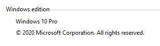
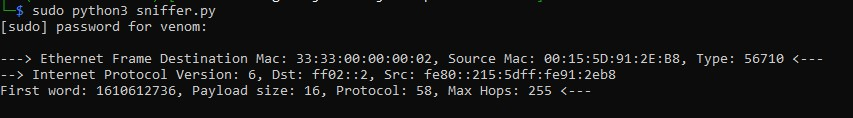
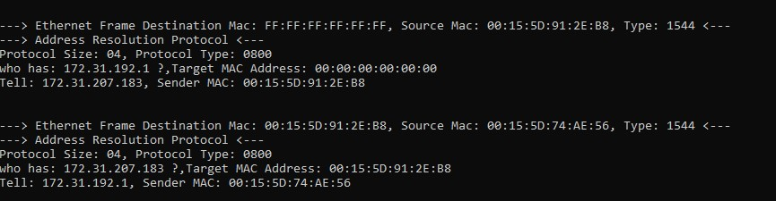
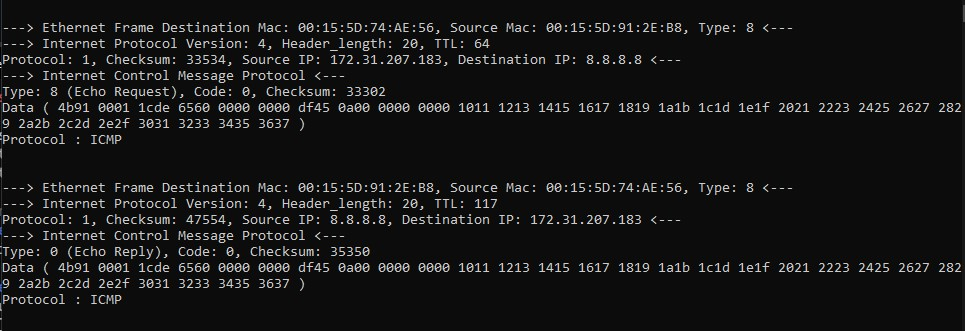
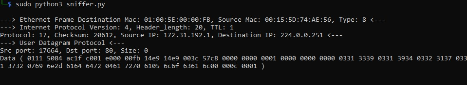
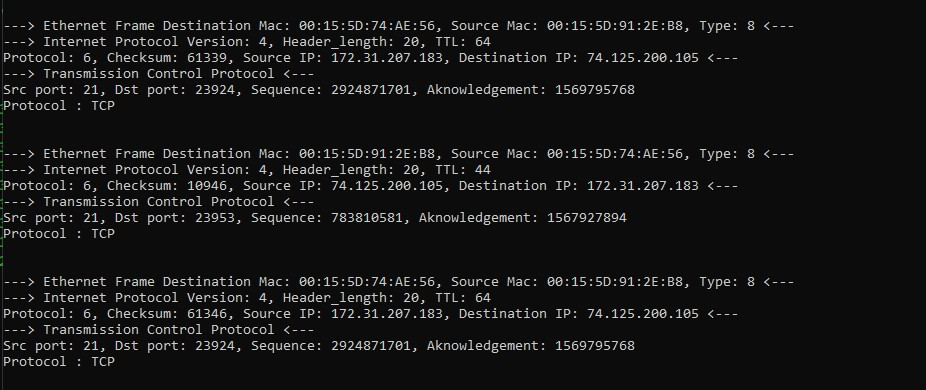
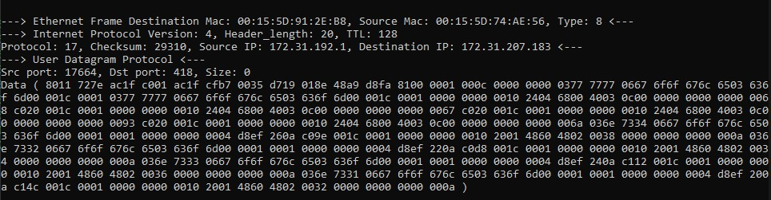
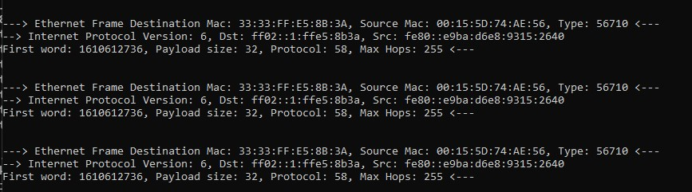

# Sniffer Utility
   This illustrates the use of **TCPDUMB** command

### [REFERENCE?](https://en.wikipedia.org/wiki/Packet_analyzer)
  Tcpdump is a data-network packet analyzer computer program that runs under a command line interface. It allows the user to display TCP/IP and other packets being transmitted or received over a network to which the computer is attached
  
  
 

### _USAGE_
- [x] Ethernet
- [x] ARP
- [x] IPv6
- [x] IPv4
- [x] TCP
- [x] UDP
- [x] ICMP
  
#### I have tested this program on Windows 10 Enterprise using WSL ver 2.

 

-----------------------------------
###       W I N D O W S
-----------------------------------
Excute this program using WSL
- open WSL Terminal
- navigate to  file path
- type the following command
>python sniffer.py www.github.com [URL]  
>python sniffer.py 8.8.8.8 [IpAddr]  
-----------------------------------
###         L I N U X
-----------------------------------
- open terminal
- navigate to file path
- type the following command
>sudo python3 sniffer.py www.github.com [URL]  
>sudo python3 sniffer.py 8.8.8.8 [IpAddr]  

### _REQUIRMENT_
- Run using SUDO privilege
- Run using Administration privilege

### _RESULT_

- Ethernet
    

- ARP
    

- ICMP
    
    
- UDP
    

- TCP
    

- IPv4
    

- IPv6
    

### Demonstration 

