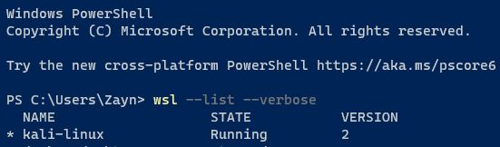

# Wireshark-Lite
Sniffer Using Python! 

### Whats The Use?
    Packet sniffer that can intercept and log traffic that passes over a computer network or part of a network.
    
### USAGE 
- [x] ICMP
- [x] ARP
- [x] IPv4
- [x] TCP
- [x] UDP
- [ ] DNS
- [x] I have tested this program on Windows 10 Enterprise using WSL ver 2.

 
-----------------------------------
###       W I N D O W S
-----------------------------------
Excute this program using WSL
- open WSL Terminal
- navigate to  file path
- type the following command
>python sniffer.py www.github.com [DomainName]  
>python sniffer.py 8.8.8.8 [IpAddr]  
-----------------------------------
###         L I N U X
-----------------------------------
- open terminal
- navigate to file path
- type the following command
>sudo python3 sniffer.py www.github.com [DomainName]  
>sudo python3 sniffer.py 8.8.8.8 [IpAddr]  

### REQUIRMENT
- Run using SUDO privilege
- pip3 install -r requirements.txt
- Run using Administration privilege
- pip install -r requirements.txt

### The OUTPUT of the PROGRAM

### Demo

