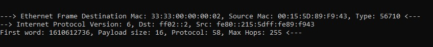
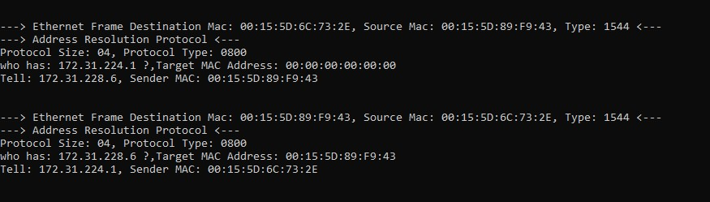
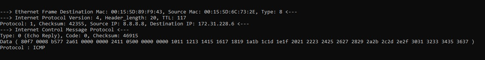
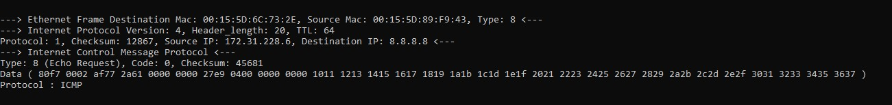

# Sniffer Utility
   This illustrates the use of **TCPDUMB** command

### [TCPDUMP]
  Tcpdump is a data-network packet analyzer computer program that runs under a command line interface. It allows the user to display TCP/IP and other packets being transmitted or received over a network to which the computer is attached.
  
#### BOOK
   https://jadhusan-s.medium.com/monitor-your-internet-traffic-in-real-time-sniffer-utility-ed686a066bc4
  
### _USAGE_
- [x] Ethernet
- [x] ARP
- [x] IPv6
- [x] IPv4
- [x] TCP
- [x] UDP
- [x] ICMP
  
#### I have tested this program on Windows 10 Enterprise using WSL ver 2.

 

 

-----------------------------------
###       W I N D O W S
-----------------------------------
Excute this program using WSL
- open WSL Terminal
- navigate to  file path
- type the following command
>python sniffer.py www.google.com   
>python sniffer.py 8.8.8.8   
-----------------------------------
###         L I N U X
-----------------------------------
- open terminal
- navigate to file path
- type the following command
>sudo python3 sniffer.py www.google.com   
>sudo python3 sniffer.py 8.8.8.8   

### _REQUIRMENT_
- Run using SUDO privilege
- Run using Administration privilege

### _Output_

- Ethernet
    

- ARP
    

- ICMP ECHO REPLY
    
    
- ICMP ECHO REQUEST
    
    
- UDP
    

