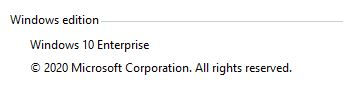
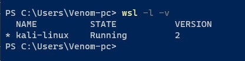

# Sniffer Utility
    This illustrates the use of TCP DUMB command

### [REFERENCE?](https://en.wikipedia.org/wiki/Packet_analyzer)
    Packet sniffer that can intercept and log traffic that passes over a computer network or part of a network.
        
### USAGE 
- [x] Ethernet
- [x] ARP
- [x] IPv6
- [x] IPv4
- [x] TCP
- [x] UDP
- [x] ICMP
- [ ] DNS
  
#### I have tested this program on Windows 10 Enterprise using WSL ver 2.

 

-----------------------------------
###       W I N D O W S
-----------------------------------
Excute this program using WSL
- open WSL Terminal
- navigate to  file path
- type the following command
>python sniffer.py www.github.com [DomainName]  
>python sniffer.py 8.8.8.8 [IpAddr]  
-----------------------------------
###         L I N U X
-----------------------------------
- open terminal
- navigate to file path
- type the following command
>sudo python3 sniffer.py www.github.com [DomainName]  
>sudo python3 sniffer.py 8.8.8.8 [IpAddr]  

### REQUIRMENT
- Run using SUDO privilege
- pip3 install -r requirements.txt
- Run using Administration privilege
- pip install -r requirements.txt

### RESULT

 - ICMP
 

 - UDP
 

 - ARP
 
 
 - Ethernet
 

- IPv6

- IPv4

- TCP

- UDP

### Demonstration 

